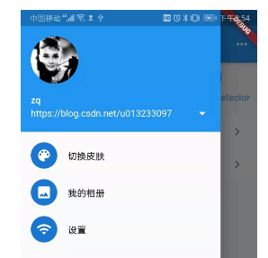

# A Simple Flutter Demo

A new Flutter project.

## Getting Started

This project is a Basic usage method about flutter.

A few resources to get you started if this is your first Flutter project:

- [Lab: Write your first Flutter app](https://flutter.dev/docs/get-started/codelab)
- [Cookbook: Useful Flutter samples](https://flutter.dev/docs/cookbook)

##Introduce: 
#####一个简单的Demo。介绍Flutter的基本使用方法。包含基本的组件使用技巧。布局使用技巧。布局使用技巧。Material风格以及Cupertino基本风格。网络请求等。

###[一,基础组件的使用](#first)

 [1,基本组件](#Widget) </p>
   
   - [Image](#Image) ：  头像使用：</p>
    
     </p>
    
``` 
        UserAccountsDrawerHeader(
            accountName: new Text("zq"),
            accountEmail: new Text("https://blog.csdn.net/u013233097"),
            currentAccountPicture: ClipOval(
              child: SizedBox(
                width: 80.0,
                height: 80.0,
                child: Image.network(
                    'https://avatar.csdn.net/C/D/F/3_u013233097.jpg',
                    fit: BoxFit.fill),
              ),
            ),
            onDetailsPressed: () {},
          )
```
      
   - [Button](#Button) : 按钮使用:</p>
```
    RaisedButton(
      child: Text("normal"),
      onPressed: () {},
    );
```
 
   - [Dialog](#Dialog): 弹出框:</p>
      
    
      </p>

 ```   
//popMenu
  Widget createPopMenus(BuildContext context) {
    return PopupMenuButton<ConferenceItem>(
      tooltip: "actions",
      offset: Offset(0, 45),
      onSelected: (ConferenceItem selectedItem) {
        if (selectedItem.index == 0) {
          //弹出  alertDialog
          prefix0
              .showDialog(
            context: context,
            barrierDismissible: true,
            builder: (BuildContext context) {
              return new AlertDialog(
                title: new Text('AlertDialog'),
                content: new SingleChildScrollView(
                  child: new ListBody(
                    children: <Widget>[
                      new Text('this is alert content ?'),
                    ],
                  ),
                ),
                actions: <Widget>[
                  new FlatButton(
                    child: new Text('cancel'),
                    onPressed: () {
                      Navigator.of(context).pop();
                    },
                  ),
                  new FlatButton(
                    child: new Text('sure'),
                    onPressed: () {
                      Navigator.of(context).pop();
                    },
                  ),
                ],
              );
            },
          )
              .then((val) {
            print(val);
          });
        } else if (selectedItem.index == 1) {
          //弹出 SimpleDialog
          prefix0
              .showDialog(
            context: context,
            barrierDismissible: true,
            builder: (BuildContext context) {
              return new SimpleDialog(
                title: new Text('SmpleDialog'),
                children: <Widget>[
                  new SimpleDialogOption(
                    child: new Text('item1'),
                    onPressed: () {
                      Navigator.of(context).pop();
                    },
                  ),
                  new SimpleDialogOption(
                    child: new Text('item1'),
                    onPressed: () {
                      Navigator.of(context).pop();
                    },
                  ),
                ],
              );
            },
          )
              .then((val) {
            print(val);
          });
        } else if (selectedItem.index == 2) {
          //show SnackBar
          _homeScaffoldKey.currentState.showSnackBar(new SnackBar(
            duration: Duration(seconds: 2),
            content: new Text("this is a snackBar"),
          ));
        }
      },
      itemBuilder: (BuildContext context) {
        return <PopupMenuEntry<ConferenceItem>>[
          const PopupMenuItem(
              child: Text("AlertDialog"), value: ConferenceItem.AlertDialog),
          const PopupMenuItem(
              child: Text("SimpleDialog"), value: ConferenceItem.SimpleDialog),
          const PopupMenuItem(
              child: Text("SnackBar"), value: ConferenceItem.SnackBar),
        ];
      },
    );
  } 
```  
    
 [2,布局使用](#layout):

   </p>


   - [Align对齐布局](#Align)
```
 new Align(
            alignment: FractionalOffset(0.0, 0.0),
            child: new Image.asset(
              "lib/imgs/类层次结构.png",
              width: 120,
              height: 60,
            ),
          ),
```

   - [FittedBox 缩放布局](#FittedBox)
```dart in html
child: new FittedBox(
//          fit: BoxFit.contain,//铺满  横向铺满
//          fit: BoxFit.cover, //放大
//          fit: BoxFit.fitWidth, //铺满宽度
//          fit: BoxFit.fitHeight, //铺满高度
//          fit: BoxFit.fill, //铺满高度  填充 不按照宽高比
          fit: BoxFit.none, //铺满高度  填充 不按照宽高比   不填充

          alignment: Alignment.topLeft,
          child: new Container(
            color: Colors.deepPurple,
            child: new Text("缩放布局"),
          ),
        ),
``` 
  
   - [StackPositioned 布局](#StackPositioned) 
```dart in html
 child: new Stack(
          children: <Widget>[
            //底部 添加一个   头像
            new CircleAvatar(
              backgroundImage: new AssetImage("lib/imgs/运算符.jpg"),
              radius: 100,
            ),

            //设置定位 布局
            new Positioned(
                bottom: 20,
                left: 50,
                child: new Text(
                  "==================",
                  style: TextStyle(
                      fontSize: 36,
                      fontWeight: FontWeight.bold,
                      fontFamily: 'serif',
                      color: Colors.white),
                ))
          ],
        ),
```
   
   - [IndexedStack 布局](#IndexedStack)
```dart in html
 child: new IndexedStack(
          index: 1,   //只显示 索引值指向的  子元素
          children: <Widget>[
            //底部 添加一个   头像
            new CircleAvatar(
              backgroundImage: new AssetImage("lib/imgs/运算符.jpg"),
              radius: 100,
            ),

            //设置定位 布局
            new Positioned(
                bottom: 20,
                left: 50,
                child: new Text(
                  "==================",
                  style: TextStyle(
                      fontSize: 36,
                      fontWeight: FontWeight.bold,
                      fontFamily: 'serif',
                      color: Colors.black38),
                ))
          ],
        )
```    
    
 [3,手势事件](#GestureDetector)
```dart in html
 child: new GestureDetector(
          onTapDown: (detail) {
            ToastUtil.toast(context, "点击事件"); //点击屏幕立即出发 此方法
          },
          onTapUp: (detail) {
            ToastUtil.toast(context, "手指离开屏幕"); //手指离开屏幕  触发此方法
          },
          onTap: () {
            ToastUtil.toast(context, "一次 tap事件");
          },
          onDoubleTap: () {
            ToastUtil.toast(context, "双击事件");
          },
          onLongPress: () {
            ToastUtil.toast(context, "长按事件");
          },
          onVerticalDragStart: (fun) {
            ToastUtil.toast(context, "垂直拖动，");
          },
          onHorizontalDragStart: (fun){
            ToastUtil.toast(context, "水平拖动，");
          },
          child: new Container(
            padding: new EdgeInsets.all(12),
            decoration: new BoxDecoration(
                color: Theme.of(context).buttonColor,
                borderRadius: new BorderRadius.circular(10)),
            child: new Text(
              "测试按钮",
              style: TextStyle(
                fontSize: 12,
              ),
            ),
          ),
        ),
```

 [4,基本动画](#animation) </p>

   - [帧动画](#Image) </p>
    
   - [补间动画](#Button) </p>
    
   - [属性动画](#Dialog) </p>

- [网络请求](#net)

    - [获取一个图片](#Image)
    - [获取一个Json](#Button)
    - [传参](#Dialog)

###[二,第三方库的使用](#second)

- [chat](#Widget)

- [codeScan](#layout)

- [网络请求](#net)

###[三,设计模式Bloc](#third)

- [bloc模式介绍](#blcoBrief)

- [bloc模式设计和使用](#blocUse) 

##start code：

### <a id="first">一,基础组件的使用</a>

### <a id="second">二,第三方库的使用</a>

### <a id="third">三,第三方库的使用</a>