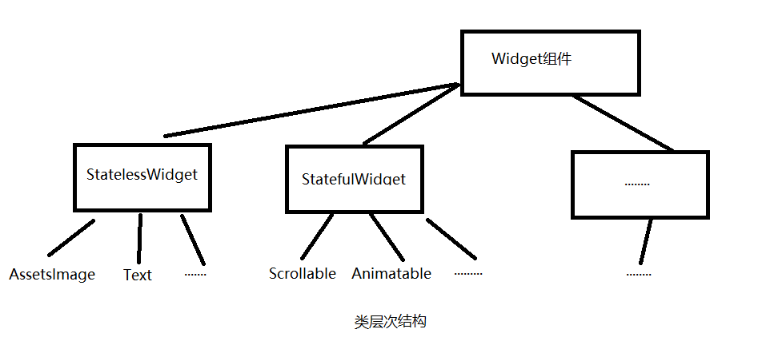
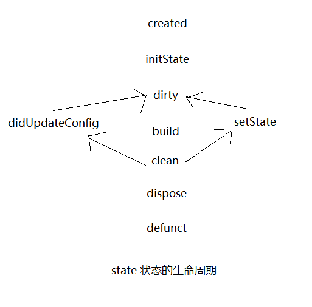

##Flutter 第一章

1,flutter的理解：

跨平台性:目前至少夸五中平台。Mac,Android,Windows,Linux,Ios。
UI:使用了大量的 Material Design和Cupertino风格组件。
60fps超高性能，完全可以胜任游戏的制作。

2，一切皆为组件：Widget 是Flutter用户程序构建的基本构建块。按钮，输入框，卡片，动画，手势都可以视为Widget。

有状态组件：是界面状态会发生变化的组件。
无状态组件：即界面不发生变化的组件。



3,构建一个Widget:
需要重写 Widget 的build方法来构建一个组件:
`@protected Widget build(BuildContext context)`

State:一个Widget的状态。即一个需要改变状态的Widget需要通过setState来改变数据值。并通知框架更新界面。
同React中的状态概念一致。




4，无状态组件和 有状态组件：

定义一个无状态组件：
 ```
//=======myApp 不做状态处理  所以是无状态的====无状态 组件========
 class MyApp extends StatelessWidget {
   //继承的  方法：
   @override
   Widget build(BuildContext context) {
     final String title = "flutterDemo";
     var app = new MaterialApp(
         theme: ThemeData(
           brightness: Brightness.light, //使用亮色 主体
           primaryColor: Colors.lightGreen[800],
           accentColor: Colors.orange[800], //前景色  文本按钮颜色
         ), // app主题样式
         home: new MyHomePage(
           title: title,
         ));
     return app;
   }
 } 
```
 
定义一个有状态组件：
 
 ```//有状态  需要变化   继承自 StatefulWidget
 class MyHomePage1 extends StatefulWidget {
   final String title;
   const MyHomePage1({Key key, this.title}) : super(key: key);
   @override
   State<StatefulWidget> createState() => new _MyHomePageState();
 }
 //必须 继承 State类      注意后面的  泛型应该为  widget组件
 class _MyHomePageState extends State<MyHomePage1> {
   int counter = 0;
   @override
   Widget build(BuildContext context) {
     // TODO: implement build
     var homPage = new Scaffold(
       appBar: new AppBar(
         title: new Text(widget.title),
       ),
       //居中布局
       body: new Center(
         //垂直布局
         child: new Column(
           //主轴   居中对齐
           mainAxisAlignment: MainAxisAlignment.center,
           children: <Widget>[
             new Text('要展示的state:', style: Theme.of(context).textTheme.display1),
             new Text(
               "counter=" + "$counter",
               style: Theme.of(context).textTheme.display1,
             )
           ],
         ),
       ),
       floatingActionButton: new FloatingActionButton(
         onPressed: () => {
           setState(() {
             counter++;
           }), //方法  用于更改数据状态
         },
         tooltip: "Increment",
         child: new Icon(Icons.add),
       ),
     );
     return homPage;
   }
 }
```
 


