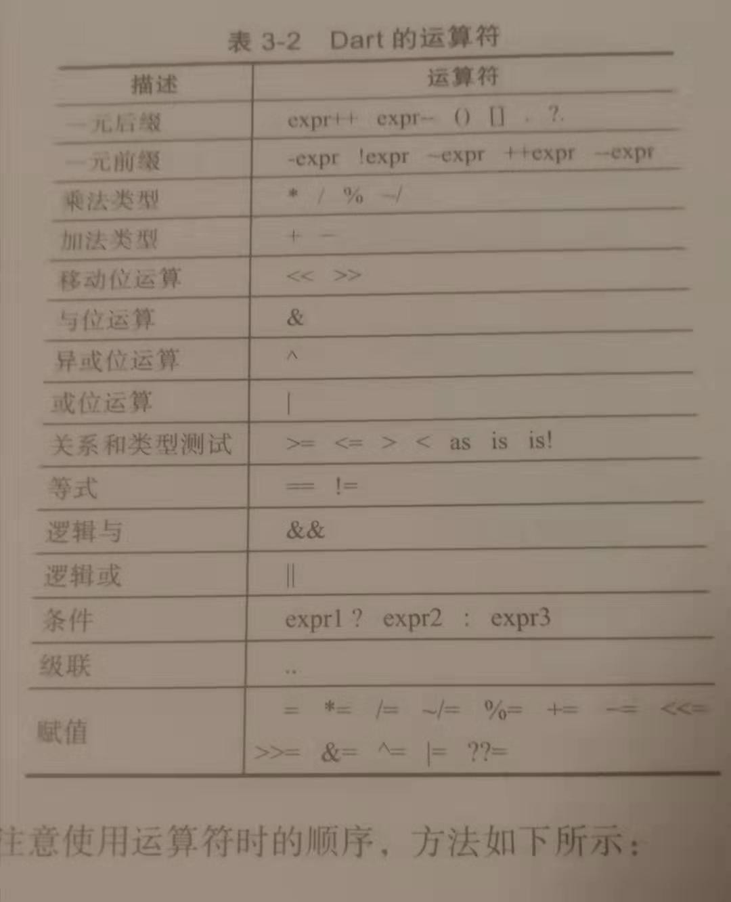

### Dart  基本语法：

####一,变量和基本数据类型：

概念：
一切皆是对象，无论是变量，数字，函数等都是对象。所有对象都是类的实例。
程序指定类型不是必须的,Dart语言是弱数据类型。指定数据类型和编译时的常量，可以提高运行速度。

1,基本数据类型：
Number,String,Boolean,List,Map.

2,常量和固定值：
final,const 修饰。

3，关键字（56个）：

abstract,do,import,super,as,dynamic,in,switch,assert,
else,interface,sync*,enum,implements,is,this,async*,export,library,throw,
await,external,mixin,true,break,extends,new,try,case,factory,null,typeof,
catch,false,operator,var,class,final,part,void,const,finally,rethrow,while,
continue,for,return,with,covariant,get,set,yield*,default,if,static,deferred.

4,核心库：

dart:core:核心库。包括strings,numbers,collections,errors,dates,URIs等。
dart:html:网页开发里DOM相关的一些库。
dart:io:I/O命令行使用的IO库。

####二,函数：

1,函数可以做为参数出传递给其他函数。方便回调。
2,将参数使用[]括起来，表明是可选参数，可以不用传递。
3,[String from='默认参数']  如果参数中 from不传递则会使用默认值。
4,所有的函数都会有返回值,若未指定返回值则默认返回值为null。系统会在没有返回值的函数后面添加隐式return 语句。

###三,运算符：

类型运算符: 

as:类型转换。
is:当对象是相应类型时返回true。
is!:当对象不是相应类型时返回true。

赋值运算符：

a=value : 将value赋值给a变量。
b ??= value：如果b为null,则将value赋值给b，否则b保持不变。

条件表达式：

condition ? expr1 : expr2 condition为真  执行expr1 否则执行 expr2.

级联操作：
使用 ..表示级联操作：可以对同一对象执行一系列操作。类似于java语言里 的点点点的 处理或者js中 Promise 的then处理。
querySelector('#btnOk')  //获取一个  id 为btnOk的 按钮对象。
        ..text = '确定' // 使用它的成员
        ..classes.add('ButtonOKStyle')
        ..onClick.listener((e)=>window.alert('确定'))
        
###流程控制语句：
1,if else
2,for
3,while  和 do-while
4,break  和 continue
5,switch 和 case
6,assert(断言) 
7,try catch 和 throw.

assert: 通过assert 来中断正常执行的流程,当assert的判断条件为false时，发生中断。只要是任何可以转化为boolean类型的对象都可以通过assert来断言。
如果assert的判断为true,则继续执行下面的语句。反之则会抛出一个断言错误异常AssertionError.

###异步支持：

必须在一个使用了async关键字标记后的函数中使用await表达式。

###元数据：

@deprecated :被弃用的。
@override :重写。
@proxy :代理。

注释：

// ：单行注释

/**  **/ ：多行注释

/** 或者 ///: 文档注释。

  
        
        
        

